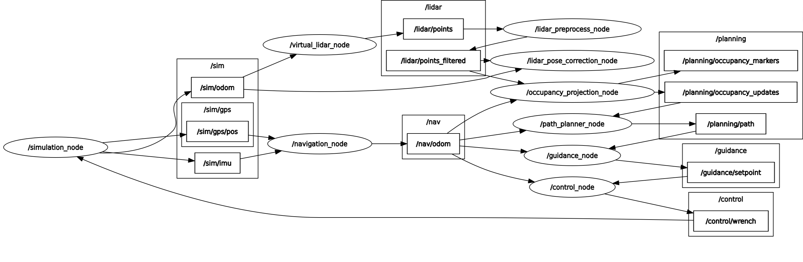
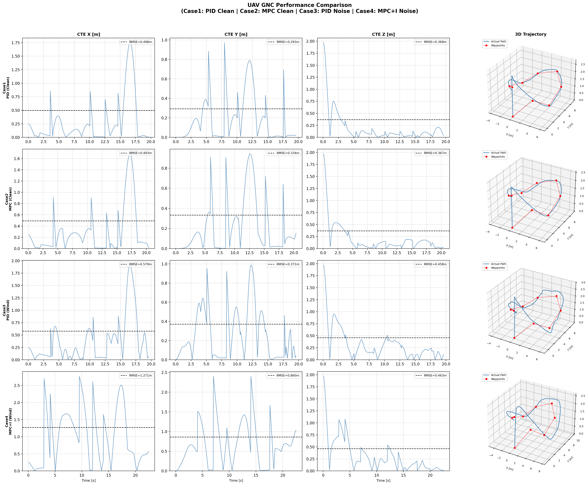
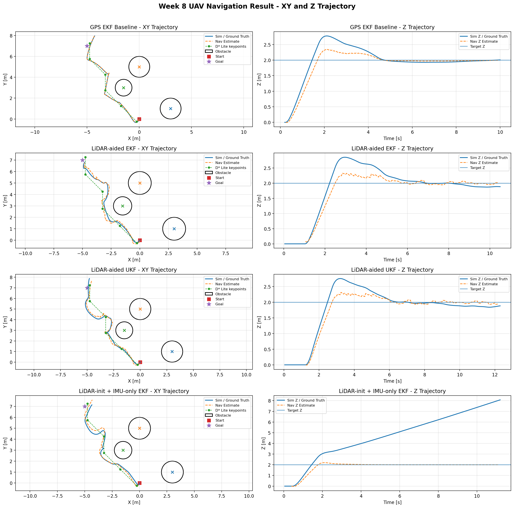
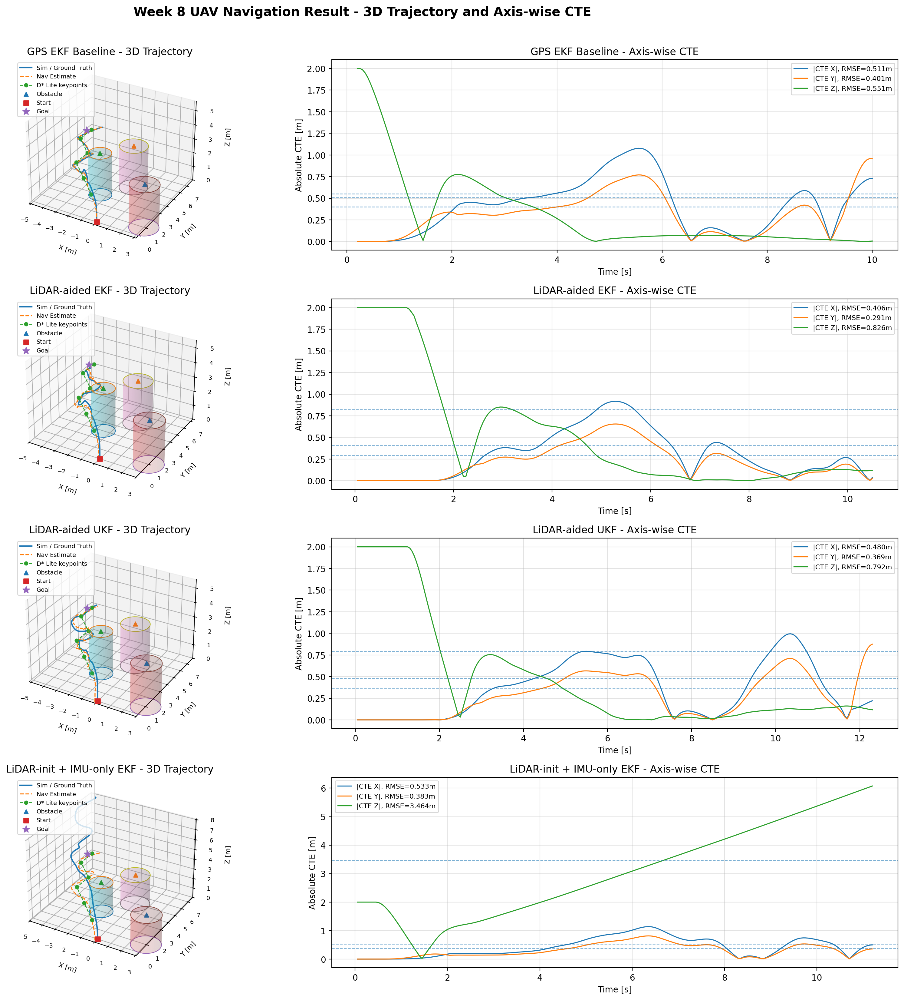
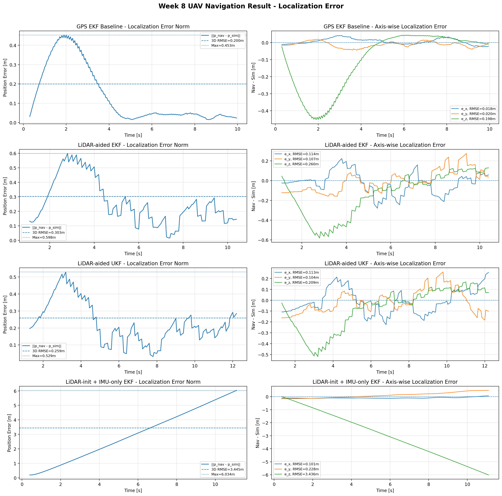
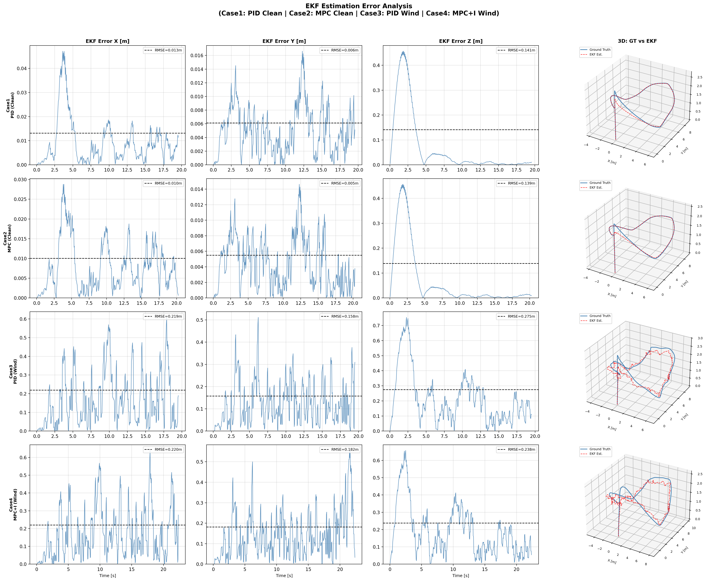

# UAV GNC System — ROS2-based Autonomous Flight

> **End-to-end Guidance · Navigation · Control** system for unmanned aerial vehicles, built from scratch using ROS2 Humble and C++.

---

## Overview

This project implements a complete UAV GNC (Guidance, Navigation, and Control) pipeline entirely from scratch — without relying on PX4, ArduPilot, or any off-the-shelf autopilot stack. Every core module, from the 6-DOF physics simulator to the optimal controller, was designed and implemented independently.

**Key highlights:**
- 6-DOF Newton-Euler flight dynamics simulator with RK4 integration
- 15-State Error-State EKF fusing IMU (100 Hz) and GPS (10 Hz)
- Multi-Segment Minimum Snap trajectory optimization (8N × 8N matrix system)
- Cascaded PID controller with feedforward and integral disturbance rejection
- Linear MPC (Condensed formulation) with precomputed K_first — 100 Hz real-time
- Robustness testing under constant wind disturbance (1 N) and GPS noise (0.5 m)

---

## System Architecture





| Node | Responsibility | Rate |
|------|---------------|------|
| `simulation_node` | 6-DOF UAV dynamics simulation (RK4), generates ground truth `/sim/odom`, IMU, and GPS measurements with noise and disturbance | 100 Hz |
| `virtual_lidar_node` | Generates synthetic 3D LiDAR point cloud from simulated UAV pose and obstacle environment | ~10 Hz |
| `lidar_preprocess_node` | Filters LiDAR point cloud (range, height, voxel downsampling) and publishes `/lidar/points_filtered` | ~10 Hz |
| `lidar_pose_correction_node` | Generates LiDAR-derived pose correction (pseudo-measurement) when sufficient points are available for GPS-denied navigation | ~10 Hz |
| `occupancy_projection_node` | Projects 3D LiDAR points into a 2.5D occupancy grid and publishes obstacle updates for planning | ~10 Hz |
| `path_planner_node` | D* Lite incremental path planner using occupancy grid and current `/nav/odom`, outputs obstacle-aware path `/planning/path` | ~5–10 Hz |
| `navigation_node` | EKF / UKF-based state estimation (IMU prediction + GPS or LiDAR correction), outputs `/nav/odom` | 100 Hz predict / 10 Hz update |
| `guidance_node` | Converts planner path into smooth trajectory using multi-segment minimum-snap and generates reference setpoints | 20 Hz |
| `control_node` | Executes cascaded PID or Linear MPC for trajectory tracking using `/nav/odom` and guidance setpoints | 100 Hz |

---

## Features

### Navigation — 15-State Error-State EKF
- **State vector:** position (3), velocity (3), attitude error δθ (3), accelerometer bias (3), gyroscope bias (3)
- **Prediction (100 Hz):** IMU-driven system model integration with Jacobian propagation
- **Update (10 Hz):** GPS position measurement, Kalman gain computation, quaternion error injection
- Numerical stability via error-state (δθ) representation — avoids quaternion singularities

### Navigation — EKF / UKF Sensor Fusion
- Supports both Error-State EKF and UKF through a `filter_type` parameter in `navigation.yaml`.
- EKF uses Jacobian-based linearization, while UKF uses sigma-point propagation to handle nonlinear state evolution.
- The navigation node can be configured for GPS-aided, LiDAR-aided, or LiDAR-initialized IMU-only experiments.
- The estimated state is published as `/nav/odom` and used by the planner, guidance, and controller.

### GPS-denied LiDAR-aided Navigation
- Adds LiDAR-derived pose correction as an external measurement source for the EKF/UKF.
- Enables GPS-denied navigation by fusing IMU prediction with LiDAR pose correction.
- Includes an IMU-only comparison mode where the filter is initialized once from LiDAR and then runs without external correction.
- Demonstrates that LiDAR-aided EKF/UKF can maintain bounded localization error when GPS updates are disabled.

### Guidance — Multi-Segment Minimum Snap
- Solves an **8N × 8N** constrained linear system (Eigen HouseholderQR) for N trajectory segments
- Guarantees continuity up to snap (4th derivative) at all intermediate waypoints — no stop-and-go behavior
- **Z-axis decoupled** to linear interpolation to prevent Runge's Phenomenon in altitude
- **Reference Preview** for MPC: publishes future N-step position/velocity array at 20 Hz

### Control — Cascaded PID
- Three-loop cascade: position → velocity → attitude
- Feedforward velocity (v_ref) and acceleration (a_ref) from guidance polynomial
- Integral term with anti-windup for steady-state disturbance rejection
- XY/Z gain separation matching physical decoupled dynamics

### Control — Linear MPC (Condensed Formulation)
- Hover-linearized double integrator model: `x = [px, py, pz, vx, vy, vz]`
- Prediction horizon N = 15, control period dt = 0.01 s
- **Precomputed K_first** (3 × 90): runtime reduces to a single matrix-vector multiply → 100 Hz capable
- XY/Z separated Q/R weights reflecting physical priority differences
- Reference Preview integration: `Xref[k] = trajectory at t + k·dt`
- MPC+I variant: integral compensation term added to handle persistent wind disturbance

### Planning — D* Lite Path Planner
- Implements D* Lite-based incremental path planning for obstacle-aware UAV navigation.
- Uses the current navigation estimate `/nav/odom` as the start state and a configurable goal position from `planner.yaml`.
- Supports dynamic occupancy updates, allowing the planner to regenerate paths when obstacle cells change.
- Publishes the planned path through `/planning/path`, which is then converted into smooth trajectory references by the guidance node.
- Extracts key waypoints from the raw grid path to make the output suitable for minimum-snap trajectory generation.

### Perception — Virtual 3D LiDAR and 2.5D Occupancy Projection
- Implements a virtual 3D LiDAR pipeline connected to the internal 6-DOF simulator.
- Generates point cloud data from the simulated UAV pose and predefined obstacle environment.
- Applies point cloud preprocessing such as range filtering, height filtering, and downsampling.
- Projects 3D LiDAR points into a 2.5D occupancy grid around the UAV flight altitude.
- The 2.5D map representation keeps the planner lightweight while still using 3D LiDAR point cloud information.

### Evaluation and Visualization
- Logs tracking error, mission completion status, and flight metrics through `tracking_eval_node`.
- Logs actual D* Lite path keypoints through `planning_path_logger_node`.
- Provides visualization scripts for XY trajectory, 3D trajectory, obstacle avoidance, axis-wise CTE, and localization error.
- Generates README-ready result tables and figures for GPS-denied LiDAR-aided navigation experiments.

---

## Performance Results

### 4-Case Robustness Comparison

| Case | Wind | GPS Noise | Controller | Flight Time | RMSE 3D | Completed |
|------|------|-----------|-----------|------------|---------|-----------|
| Case 1 | None | 0.01 m | PID | 18.5 s | 0.685 m | ✅ |
| Case 2 | None | 0.01 m | MPC | 19.2 s | 0.699 m | ✅ |
| Case 3 | 1.0 N (X/Y) | 0.5 m | PID | 18.4 s | 0.826 m | ✅ |
| Case 4 | 1.0 N (X/Y) | 0.5 m | MPC+I | 18.6 s | 1.603 m | ✅ |

**Robustness:** PID degraded by ×1.21 under wind; MPC+I degraded by ×2.29.



> Trajectory: 9-waypoint heptagon with 3D altitude variation (Z: 1.0 ~ 2.0 m),  
> avg_speed = 1.5 m/s, sim/nav evaluated separately (EKF + GPS 0.5 m noise)

### GPS-denied LiDAR-aided Navigation

This experiment evaluates whether LiDAR-derived pose correction can stabilize UAV state estimation when GPS updates are disabled. Four cases were compared: GPS-aided EKF baseline, LiDAR-aided EKF, LiDAR-aided UKF, and LiDAR-initialized IMU-only EKF. The IMU-only case uses the first LiDAR pose only for initialization and then runs without GPS or LiDAR correction.

#### Experiment Conditions

| Case | Filter | GPS Update | LiDAR Update | LiDAR Init Only | Description |
|---|---|---:|---:|---:|---|
| GPS EKF Baseline | EKF | ON | OFF | OFF | IMU + GPS correction baseline |
| LiDAR-aided EKF | EKF | OFF | ON | OFF | GPS-denied EKF with LiDAR pose correction |
| LiDAR-aided UKF | UKF | OFF | ON | OFF | GPS-denied UKF with LiDAR pose correction |
| LiDAR-init + IMU-only EKF | EKF | OFF | OFF | ON | Initial LiDAR pose only, then IMU prediction only |



The XY trajectory plot shows that the D* Lite planner generates obstacle-avoiding keypoints instead of a direct straight-line path to the goal. The simulated UAV trajectory and the navigation-estimated trajectory follow the planned route while avoiding the circular obstacle footprints. In the Z trajectory plot, the GPS-aided and LiDAR-aided cases remain bounded around the target flight altitude, while the LiDAR-initialized IMU-only case shows severe altitude drift due to the absence of external position correction.



The 3D trajectory plot visualizes the obstacle cylinders, D* Lite keypoints, simulator ground truth, and navigation estimate in the same frame. The GPS EKF baseline, LiDAR-aided EKF, and LiDAR-aided UKF complete the obstacle-avoidance mission, while the IMU-only case diverges vertically and fails to complete the mission. The axis-wise CTE plots show that most of the IMU-only failure comes from the Z-axis error, confirming that external correction is essential for stable inertial navigation.



The localization error is computed as the difference between `/nav/odom` and the simulator ground truth `/sim/odom` after time synchronization. The GPS EKF baseline maintains the smallest overall localization error under normal GPS-aided conditions. When GPS is disabled, both LiDAR-aided EKF and UKF keep the localization error bounded by using LiDAR-derived pose correction. In contrast, the LiDAR-init + IMU-only case accumulates large vertical drift, demonstrating why continuous external correction is required in GPS-denied navigation.

Overall, the results show that GPS-denied navigation is feasible when LiDAR-derived pose correction is fused with IMU prediction. The LiDAR-aided EKF and UKF both completed the mission without GPS, whereas the IMU-only estimator failed due to accumulated drift after initialization. The UKF achieved localization performance close to the GPS EKF baseline in this single-run experiment, but a statistically rigorous EKF-vs-UKF comparison would require Monte Carlo testing with fixed random seeds and repeated trials.

Tracking RMSE includes the initial takeoff transient from ground level to the target altitude. Therefore, the localization RMSE is the more important metric for evaluating the navigation upgrade, while the tracking RMSE reflects the combined behavior of planning, guidance, control, and state estimation.

#### Result Summary

| Case | Mission | Time [s] | Tracking RMSE [m] | Localization RMSE [m] | Min Goal Error [m] | Key Result |
|---|---:|---:|---:|---:|---:|---|
| GPS EKF Baseline | Yes | 8.950 | 0.852 | 0.200 | 0.285 | Normal GPS-aided reference performance |
| LiDAR-aided EKF | Yes | 9.499 | 0.965 | 0.303 | 0.297 | Completed the mission without GPS |
| LiDAR-aided UKF | Yes | 11.149 | 0.997 | 0.259 | 0.198 | GPS-denied localization close to baseline |
| LiDAR-init + IMU-only EKF | No | - | 3.525 | 3.445 | 5.377 | Failed due to accumulated IMU drift |

### Key Findings — MPC vs PID Analysis

Under ideal (no-wind) conditions, Linear MPC and Cascaded PID perform comparably. Under constant wind disturbance, PID outperforms MPC due to its integral term absorbing the persistent bias. The MPC failure root cause was identified as **time-parameterization mismatch**: the guidance publishes time-indexed setpoints at 20 Hz while MPC at 100 Hz aggressively chases each setpoint, consistently overshooting the guidance schedule.

This behavior directly matches the finding in Foehn et al. (IROS 2021, arXiv:2108.13205). The architecturally correct solution is **MPCC** (Model Predictive Contouring Control) with arc-length parameterization.

### EKF Estimation Error Analysis

The 15-State Error-State EKF was evaluated independently by comparing
the filter output against the simulator ground truth across all 4 cases.



Under ideal conditions (Cases 1–2), XY estimation error remains below 0.03 m,
confirming stable sensor fusion. Z error shows a transient spike (~0.4 m)
during the initial takeoff phase, then converges to near zero — this is
expected behavior as the EKF requires several seconds to initialize altitude
from GPS. Under wind + GPS noise (Cases 3–4), XY error increases RMSE 
due to GPS measurement noise (σ = 0.5 m), while the filter maintains
consistent tracking throughout the flight.

---

## Troubleshooting Log (Selected)

| Issue | Root Cause | Solution |
|-------|-----------|----------|
| EKF NaN divergence on integration | Angular velocity missing from `/nav/odom` → D-gain damping lost | Populated `twist.angular` with raw gyro data |
| Z-axis altitude ringing (Runge's Phenomenon) | 7th-order polynomial overfitting on short Z segments | Decoupled Z to linear interpolation |
| MPC overshoots guidance schedule | Time-parameterized guidance + standard MPC structural mismatch | Reference Preview (partial fix); MPCC identified as full solution |
| MPC feedforward double-injection | `a_ref` added on top of `Xref` already containing `v_ref` | Removed `a_ref` feedforward from MPC path |
| MPC+I over-correction under wind | ki=0.3 caused integral over-compensation with time-based guidance | Reduced ki=0.15, max_int_pos=4.0 |

---

## Prerequisites

```bash
# ROS2 Humble (Ubuntu 22.04)
# Eigen3
sudo apt install libeigen3-dev

# ROS2 message and TF dependencies
sudo apt install \
  ros-humble-tf2 \
  ros-humble-tf2-geometry-msgs \
  ros-humble-nav-msgs \
  ros-humble-sensor-msgs \
  ros-humble-geometry-msgs \
  ros-humble-visualization-msgs

# Point cloud / LiDAR processing dependencies
sudo apt install \
  ros-humble-pcl-ros \
  ros-humble-pcl-conversions \
  libpcl-dev

# Visualization and graph tools
sudo apt install \
  ros-humble-rviz2 \
  ros-humble-rqt-graph

# Python analysis dependencies
sudo apt install python3-pip
pip3 install numpy pandas matplotlib
```

---

## Build & Run

```bash
# Clone and build
cd ~/uav_gnc_ws
colcon build --symlink-install
source install/setup.bash

# Run the baseline GNC pipeline
ros2 launch uav_gnc bringup.launch.py

# Run the integrated v2.0 pipeline
# Integrated pipeline:
# 6-DOF simulation + EKF/UKF navigation + virtual LiDAR
# + occupancy projection + D* Lite planning + guidance + control
# + tracking/path logging
ros2 launch uav_gnc bringup_with_path_logger.launch.py

# Visualize the ROS2 runtime graph
# Run this in a separate terminal while the launch file is running
source ~/uav_gnc_ws/install/setup.bash
rqt_graph

# Plot baseline GNC results
python3 plot_result.py

# Plot LiDAR-aided navigation results
python3 plot_lidar_nav_results.py --base-dir ~/uav_gnc_ws
```

### Configuration Files

| File | Key Parameters |
|------|----------------|
| `config/simulation.yaml` | UAV mass/inertia, wind disturbance, IMU/GPS noise, simulation timestep |
| `config/guidance.yaml` | guidance mode, waypoint lists, average speed, planner path usage |
| `config/control.yaml` | PID/MPC mode, controller gains, MPC horizon, Q/R weights, integral compensation |
| `config/navigation.yaml` | filter_type, GPS update toggle, LiDAR update toggle, LiDAR init-only mode |
| `config/planner.yaml` | D* Lite grid size, resolution, start/goal settings, static obstacles, dynamic occupancy usage |
| `config/virtual_lidar.yaml` | virtual LiDAR range, horizontal/vertical samples, obstacle model |
| `config/lidar_preprocess.yaml` | point cloud input/output topics, range filtering, z filtering, voxel downsampling |
| `config/occupancy_projection.yaml` | 2.5D occupancy grid size, resolution, altitude slicing mode |
| `config/lidar_pose_correction.yaml` | LiDAR-derived pose correction topic, noise model, publish rate, minimum point threshold |
| `config/planning_path_logger.yaml` | logging topic, CSV output path, append mode |

---

## Repository Structure

```
uav_gnc_ws/
├── src/uav_gnc/
│   ├── config/                  # YAML configuration files for simulation, control, navigation, planning, and LiDAR modules
│   ├── include/uav_gnc/
│   │   ├── controller.h         # PID and Linear MPC controller class definitions
│   │   ├── sixdof.h             # 6-DOF UAV dynamics data structures and model interface
│   │   ├── ekf.h                # 15-state Error-State EKF interface
│   │   ├── ukf.h                # Unscented Kalman Filter interface
│   │   ├── dstar_lite.h         # D* Lite incremental path planner interface
│   │   └── trajectory.h         # Minimum-snap trajectory generation interface
│   ├── launch/
│   │   ├── bringup.launch.py                   # Main launch file for the core UAV GNC pipeline
│   │   └── bringup_with_path_logger.launch.py  # Integrated launch file with D* Lite path logging enabled
│   └── src/
│       ├── guidance_node.cpp       # Converts planner waypoints into smooth minimum-snap trajectory references
│       ├── navigation_node.cpp     # EKF/UKF-based state estimation using IMU, GPS, and LiDAR pose correction
│       ├── control_node.cpp        # Runs PID or MPC control using navigation state and guidance reference
│       ├── simulation_node.cpp     # 6-DOF UAV simulator with sensor noise and disturbance models
│       ├── control/controller.cpp  # Core implementation of cascaded PID and Linear MPC
│       ├── dynamics/sixdof.cpp     # UAV rigid-body dynamics and RK4 integration model
│       ├── ekf.cpp                 # Error-State EKF prediction and measurement update implementation
│       ├── ukf.cpp                 # UKF sigma-point propagation and measurement update implementation
│       ├── trajectory.cpp          # Minimum-snap polynomial trajectory solver
│       ├── planning/
│       │   ├── dstar_lite.cpp          # D* Lite path planning algorithm implementation
│       │   └── path_planner_node.cpp   # ROS2 planner node publishing obstacle-aware paths
│       ├── perception/
│       │   ├── virtual_lidar_node.cpp          # Generates virtual 3D LiDAR point clouds from the simulator
│       │   ├── lidar_preprocess_node.cpp       # Filters and downsamples LiDAR point cloud data
│       │   ├── occupancy_projection_node.cpp   # Projects 3D LiDAR points into a 2.5D occupancy grid
│       │   └── lidar_pose_correction_node.cpp  # Publishes LiDAR-derived pose correction for GPS-denied navigation
│       └── evaluation/
│           ├── tracking_eval_node.cpp          # Logs tracking error, completion status, and flight metrics to CSV
│           └── planning_path_logger_node.cpp   # Logs actual D* Lite path keypoints for visualization
├── plot_result.py               # Legacy result visualization script for baseline GNC tests
└── plot_lidar_nav_results.py    # LiDAR-aided navigation visualization and summary script
```

---

## Tech Stack


- **Framework:** ROS2 Humble
- **Language:** C++17 (core), Python3 (analysis/visualization)
- **Linear Algebra:** Eigen3
- **Point Cloud Processing:** PCL / PointCloud2
- **Planning:** D* Lite, 2.5D occupancy grid
- **State Estimation:** Error-State EKF, UKF, LiDAR-aided pose correction
- **Visualization:** RViz2, rqt_graph, Matplotlib
- **Build System:** colcon / CMake

---

## Future Work

- **PX4 SITL integration:** connect the current ROS2 GNC stack to a Docker-based PX4 SITL environment through offboard control.
- **Real LiDAR odometry:** replace the current LiDAR-derived pose correction model with ICP/NDT or FAST-LIO/LIO-SAM-style scan matching.
- **Full 3D planning:** extend the current 2.5D occupancy grid into a 3D voxel-based planner for altitude-aware obstacle avoidance.
- **MPC + RL**: reinforcement learning for adaptive Q/R matrix tuning

---

## References

1. Foehn et al., "Time-Optimal Planning for Quadrotor Waypoint Flight," *IROS 2021* — [arXiv:2108.13205](https://arxiv.org/abs/2108.13205)
2. MathWorks, "Trajectory Optimization and Control of Flying Robot Using Nonlinear MPC" — MATLAB Documentation
3. Hassani et al., "Performance Evaluation of Control Strategies for Autonomous Quadrotors," *Complexity* (2024)
4. Mellinger & Kumar, "Minimum Snap Trajectory Generation and Control for Quadrotors," *ICRA 2011*

---

*Developed as a personal GNC portfolio project. All modules implemented independently.*